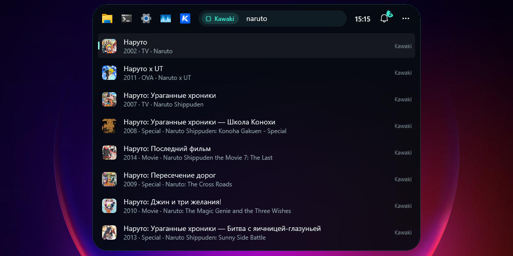
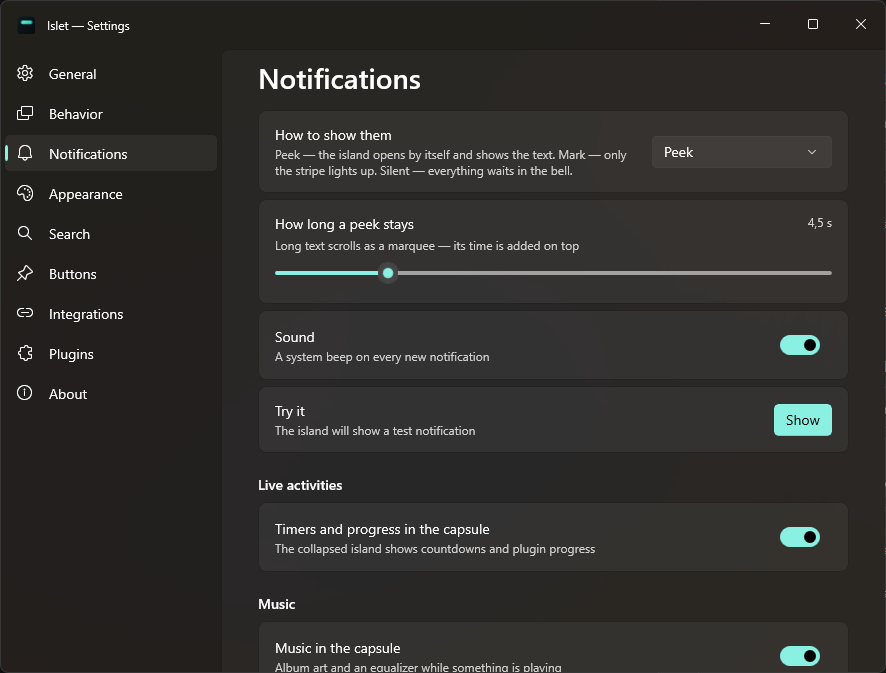

# Islet

**Русский: [README.ru.md](README.ru.md)**

A small island at the top edge of your Windows screen — a Dynamic Island for the desktop:
search your apps and every file on every drive, do quick maths, run commands, reach your
clipboard history, and get notifications, music, timers and plugins. Collapsed, it is a thin
capsule a couple of centimetres wide. Point at it — or press a hotkey — and it opens into a
search box. When music plays or a timer runs, the capsule comes alive; when a notification
arrives, the island opens by itself to show it.




No background service, no account, nothing to configure before it works: one app and a
settings file.

## What it does

- **Finds apps** — everything in `shell:AppsFolder`, Microsoft Store apps included. What you
  open often floats up: "te" goes to Telegram if you open it every day.
- **Finds files on every drive.** Windows Search only indexes your user folders on the system
  drive; Islet keeps its own index of file names for the other drives, so a file on `D:` comes
  up as fast as one on your desktop.
- **Forgives the wrong keyboard layout.** A query typed in the other layout (Russian ↔
  English) still finds things, and a hint row offers to fix the text.
- **Does maths.** `2+2*3`, `sqrt(2)`, `15%4`, `0xFF+1` — the answer comes first, Enter copies it.
- **Runs commands.** "lock", "sleep", "recycle", "theme", "wifi", "bluetooth" — system actions
  and Windows Settings pages, in both languages. Dangerous ones ask for a second Enter.
- **Remembers the clipboard.** `cb ` — recently copied text; Enter pastes it into the window
  you were in. Memory only; anything copied from password managers is skipped.
- **Runs timers.** `timer 25 tea` — a countdown right in the capsule and a notification at the end.
- **Shows what is playing.** Any player that reports to Windows: album art and a visualizer in
  the capsule, a card with controls in the open island.
- **A visualizer that hears the music.** The bars listen to what your speakers play (loopback
  capture, no microphone), split it into frequency bands and take the album's colour. Bar
  count, colour, sensitivity and frame rate are adjustable; a plain animation is an option too.
- **Changes the app's volume.** A slider in the card, and the mouse wheel over the card or the
  capsule, set the volume of whatever is playing — like the Windows volume mixer.
- **Sits where you want.** Centre, left or right — near an edge the island grows towards the
  screen.
- **Takes notifications** from Kawaki, ClipTide, plugins and your own scripts: a peek on the
  island, long text scrolls, and everything waits in the bell.
- **Falls back to the web** in the last row of results: Yandex, Google, Bing or DuckDuckGo —
  and `g `, `yt `, `w `, `gh `, `tr ` search a site directly.
- **Grows with plugins** in any language — see [docs/plugins.md](docs/plugins.md).
- **Keeps buttons** for quick launch — up to six: an app, a file, a folder or a link.
- **Stays out of the way.** Opening on hover does not steal focus: your cursor and caret stay
  in whatever you were typing in. Over a fullscreen game or video, the island hides.
- **Glass.** The backdrop is the blurred desktop, cut to the shape of the capsule. Tint density
  is adjustable and the effect can be turned off.
- **Speaks English and Russian**, following your Windows display language, and you can force
  either one in the settings.

## Install

Grab the latest build from [Releases](https://github.com/Rayness/islet/releases):

| File | What it is |
|---|---|
| `Islet-win-Setup.exe` | Installer, x64. Adds a Start menu shortcut, an entry in Installed apps, and keeps itself updated. |
| `Islet-win-Portable.zip` | Portable, x64. Unpack anywhere and run `Islet.exe`. Updates by hand. |
| `Islet-win-arm64-Setup.exe` | The installer for ARM64 machines. |
| `Islet-win-arm64-Portable.zip` | The portable build for ARM64 machines. |

Everything is bundled, so you do **not** need .NET or the Windows App SDK installed. The builds
are not code-signed yet, so SmartScreen will warn on first run: *More info → Run anyway*.

Requires Windows 10 version 2004 (build 19041) or newer, x64 or ARM64.

## How to use it

The island lives in three states:

| State | How to get there | What happens |
|---|---|---|
| Collapsed | the default | a thin capsule at the top centre, above other windows; it never takes focus |
| Hover | point at it | it opens, focus stays in your previous window; move away and it collapses |
| Open | the hotkey, `Ctrl + Alt + Space` by default | it opens with the cursor in the search box and your recent items below; press again or `Esc` to collapse and hand focus back |

The collapsed capsule changes shape by itself:

| Shape | When |
|---|---|
| Stripe | nothing is going on; lit with the accent colour when the bell has something unread |
| Live capsule | a timer or a plugin's progress is running; music plays — album art and a visualizer; the mouse wheel sets the volume |
| Peek | a notification arrived: icon, title and scrolling text. The cursor on a peek holds it, a click runs its action, the cross dismisses it |

In the results:

| Key | Action |
|---|---|
| `↑` / `↓` | pick a result |
| `Enter` | open it |
| `Ctrl + Enter` | show the file in its folder |
| `Shift + Enter` | run as administrator |
| `Tab` | complete: the row's name, the fixed layout, a keyword from the help |
| `Ctrl + C` | copy the path or address of the selected row |
| `Shift + Delete` | remove a row from *Recent* |
| `Backspace` on an empty box | leave the search scope |
| `Esc` | clear the box; again to collapse the island |

Right-click a result for *Show in folder*, *Copy path*, *Pin to the island* and whatever a
plugin adds. Right-click a button on the left to unpin it. The bell on the right keeps the
notification history; `…` opens the settings, plugins, help, and can quit the island.

### Keywords

A keyword followed by a space turns into a scope chip: the search then happens only there.
Type `?` to see all of them.

| Keyword | Searches |
|---|---|
| `=` | the calculator (expressions are recognised without it too) |
| `>` | commands and Windows Settings |
| `f ` | files and folders only |
| `cb ` | clipboard history |
| `timer ` | a timer: `5m`, `25 min`, `1:30`, with a label |
| `k ` | anime in the [Kawaki](https://kawaki.ru) catalogue |
| `ct ` | recent ClipTide downloads |
| `kill ` | running processes, to end them (plugin) |
| `g ` `y ` `yt ` `w ` `gh ` `tr ` `maps ` `so ` `npm ` `shiki ` | site search (plugin) |

## Notifications and integrations

- **Kawaki.** *Settings → Integrations* signs you in with a code: the island shows a code, you
  approve it on kawaki.ru, and the island never sees your password. Replies, friends and
  rewards arrive as peeks; `k ` searches the catalogue with posters. Tokens are stored
  encrypted with DPAPI.
- **ClipTide.** If [ClipTide](https://github.com/Rayness/YouTube-Downloader) is installed,
  finished downloads show up as peeks with a thumbnail; a click opens the folder. ClipTide needs
  no changes — the island watches its notification file.
- **Your own scripts.** `Islet.exe --notify "Backup finished" "312 files"` or a JSON line into
  `\\.\pipe\Islet.<user name>` — see [docs/protocol.md](docs/protocol.md).

## Plugins

A plugin is a folder with a `plugin.json` in `%APPDATA%\Islet\plugins`: site searches with no
code, ready-made commands, or a program in any language that answers queries with JSON lines
over stdin/stdout. Plugins can also show notifications and live activities in the capsule.
The guide is [docs/plugins.md](docs/plugins.md); a Python example lives in
[docs/examples/python-passwords](docs/examples/python-passwords).

## How the search works

Results come in groups: the calculator's answer and an address → apps → commands → files and
folders → Kawaki and plugins → *search the web*. Fast sources answer on every keystroke;
slow ones (files, network, plugins) answer after a pause in typing, in parallel, each with its
own time limit, so a stuck plugin never holds the results back. Files arrive from two
sources at once:

- **Windows Search**, through OLE DB against the system index. Fast and content-aware, but it
  only covers what Windows itself indexes — normally your user folders on the system drive.
- **Islet's own drive index** — a walk over the non-system drives (or whichever folders you
  list in the settings) that remembers file names. It lives in one binary file, is read back at
  startup, is rebuilt once a day and whenever the folder list changes, and `FileSystemWatcher`
  catches what changes in between. Lookups run in parallel over one shared character buffer,
  with no allocation per name.

The drive index can be turned off, leaving only Windows Search.

## Settings



| Section | What is in it |
|---|---|
| General | hotkey (recorded by pressing it), start with Windows, web search engine, language |
| Behavior | open on hover, open and close delays, hide the collapsed capsule, hide over fullscreen windows, which monitor to live on |
| Notifications | peek, mark on the stripe or silent; how long a peek stays; sound; live activities; music in the capsule, the *Now playing* card, app volume; the visualizer: to the sound or animated, bar count, colour, sensitivity, frame rate |
| Appearance | horizontal position, glass, background density, island width, collapsed capsule size, number of result rows, clock |
| Search | calculator, commands, clipboard history, recent items, remembering launches; the drive index, its folders and exclusions |
| Buttons | order, removal, adding an app, a file, a folder or a link |
| Integrations | Kawaki sign-in, Kawaki notifications and search, ClipTide notifications, examples for your scripts |
| Plugins | the list, on/off switches, errors, the plugins folder, reload |

Every change is saved as you make it; there is no Apply button.

## Your data

Settings live in `%APPDATA%\Islet\`, throwaway things in `%LOCALAPPDATA%\Islet.cache\`:

| File | Where | What it is |
|---|---|---|
| `settings.json` | `%APPDATA%\Islet` | settings |
| `pins.json` | `%APPDATA%\Islet` | buttons; safe to edit by hand, Islet re-reads it |
| `notifications.json` | `%APPDATA%\Islet` | the bell: the last 60 notifications |
| `history.json` | `%APPDATA%\Islet` | what you launch and how often, for *Recent*; can be turned off |
| `kawaki.dat` | `%APPDATA%\Islet` | Kawaki tokens, encrypted with DPAPI for your Windows account |
| `plugins\` | `%APPDATA%\Islet` | your plugins |
| `drive-index.bin` | `%LOCALAPPDATA%\Islet.cache` | the drive index cache; delete it and it rebuilds |
| `island.log` | `%LOCALAPPDATA%\Islet.cache` | state changes and search errors, capped at 512 KB |

The installer owns `%LOCALAPPDATA%\Islet` and wipes it on every install, which is exactly why
nothing of yours is kept there. Uninstalling leaves your settings behind.

Islet sends nothing anywhere. The only outbound traffic is what you ask for: the *search the
web* row, a link button you open, a `k ` query to kawaki.ru, polling Kawaki notifications
(only after you sign in), and the update check against GitHub.

## Building from source

You need the [.NET 10 SDK](https://dotnet.microsoft.com/download/dotnet/10.0); Visual Studio is
not required.

```powershell
git clone https://github.com/Rayness/islet.git
cd islet
dotnet build src/Islet/Islet.csproj -c Debug
src/Islet/bin/Debug/net10.0-windows10.0.22621.0/win-x64/Islet.exe
```

To build what the releases ship — installer, portable zip and update package — install the
[Velopack](https://velopack.io) CLI once with `dotnet tool install -g vpk`, then:

```powershell
build/pack.ps1                       # or: build/pack.ps1 -Version 0.2.0 -Runtime win-arm64
```

Command-line switches (the full list is in [docs/protocol.md](docs/protocol.md)):

- `--demo <query>` opens the island with a query already typed, without taking focus;
- `--settings [general|behavior|notifications|look|search|pins|integrations|plugins|about]`
  opens the settings on a given page;
- `--notify`, `--activity`, `--open`, `--quit`.

Only one instance runs at a time: a second launch hands its switches to the first one over a
named pipe and exits without loading any UI. A launch with no switches opens the island.

## How it is put together

| Where | What |
|---|---|
| `Program.cs` | a custom `Main`: a second launch forwards its switches before WinUI loads |
| `IslandWindow.xaml(.cs)` | the island: modes and capsule shapes (stripe, live capsule, peek, open), animation inside a transparent window, keyboard, results, the bell, *Now playing* |
| `SettingsWindow.xaml(.cs)`, `SettingsWindow.Pages.cs` | the settings window; the notifications, integrations and plugins pages are built in code |
| `Core/` | notifications and the bell, live activities, timers, actions (`IsletAction`), the message protocol |
| `Search/SearchService.cs`, `Search/Providers/` | results from providers: apps, files, calculator, addresses, commands, timer, clipboard, help, web |
| `Search/Frecency.cs`, `KeyboardLayout.cs` | launch frequency and recency; a query in the other layout |
| `Media/` | *Now playing* through the Windows media sessions, the sound spectrum (WASAPI loopback + FFT), app volume through audio sessions |
| `Native/CoreAudio.cs` | Core Audio interfaces: the output device, capture, audio sessions |
| `Integrations/` | Kawaki (device sign-in, notifications, catalogue) and ClipTide |
| `Plugins/` | the manifest, plugin discovery, the plugin process and the conversation with it |
| `Ipc/` | command-line switches and the named pipe |
| `Settings/` | the settings model and `SettingsStore` with its `Changed` event |
| `Native/WindowHost.cs` | window message interception: the hotkey and trimming the system frame (`WM_NCCALCSIZE`, `WM_NCACTIVATE`, `WM_STYLECHANGING`) |
| `Native/IslandBackdrop.cs` | the backdrop: a blurred desktop (`HostBackdropBrush`) masked to the capsule's shape |
| `Search/DriveIndex.cs` | the file name index: one shared character buffer, parallel lookup, on-disk cache, `FileSystemWatcher` |
| `Search/AppIndex.cs`, `FileSearch.cs` | apps from `shell:AppsFolder`, files through OLE DB against Windows Search |
| `Shell/` | shell icons and pictures by URL, launching things, the clipboard, system actions, start with Windows, updates |
| `Pins/` | the buttons and their storage |
| `Strings/` | the interface in `.resw` files, one folder per language |
| `tools/make-icon.ps1` | draws `Assets/islet.ico` |

Built on WinUI 3 (Windows App SDK 1.8), .NET 10 and Win2D — the last one only to describe the
glass effect. Updates go through Velopack. There is no MSIX packaging.

### Translating

Every string lives in `src/Islet/Strings/<language>/Resources.resw`. To add a language, copy the
`en-US` folder, translate the values, and add the language to the picker in
`SettingsWindow.xaml.cs` (`LanguageOptions`).

## License

MIT — see [LICENSE](LICENSE).
