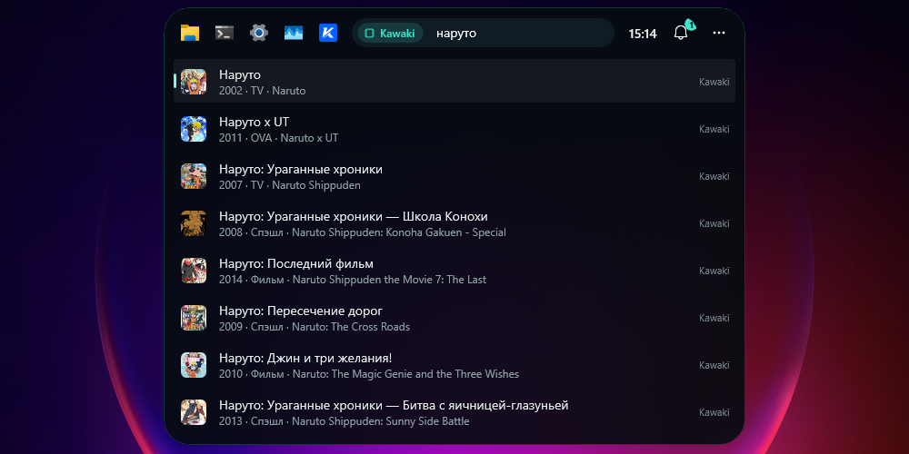
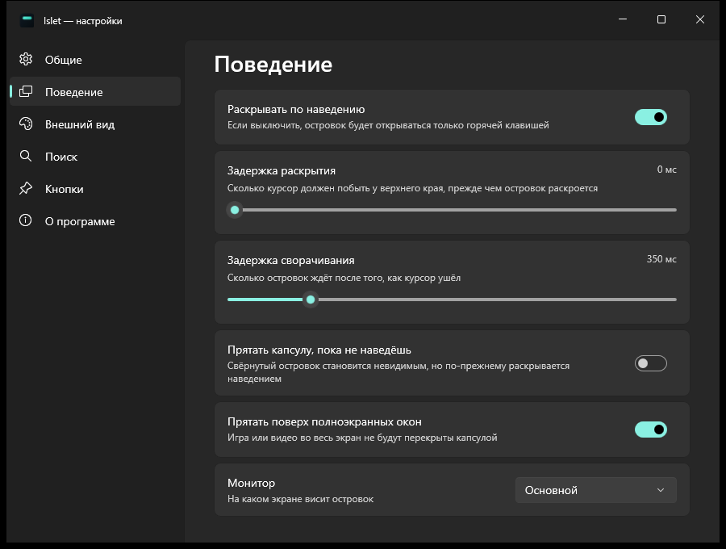

# Islet

**English: [README.md](README.md)**

Островок у верхнего края экрана Windows — как Dynamic Island, только для рабочего стола:
поиск по приложениям и файлам на всех дисках, калькулятор, команды, история буфера обмена,
уведомления, музыка, таймеры и плагины. Свёрнутый — тонкая капсула шириной в пару
сантиметров. Наводишь курсор или жмёшь горячую клавишу — раскрывается в строку поиска.
Играет музыка или идёт таймер — капсула оживает; пришло уведомление — островок сам
раскрывается и показывает его.




Без службы в фоне, без учётной записи и без настройки перед первым запуском: одно
приложение и файл настроек.

## Что умеет

- **Ищет приложения** — всё из `shell:AppsFolder`, включая приложения из Microsoft Store.
  Частое поднимается выше: «te» ведёт в Telegram, если его открывают каждый день.
- **Ищет файлы на всех дисках.** Индекс Windows покрывает только пользовательские папки
  на системном диске; Islet поверх этого держит собственный индекс имён для остальных дисков,
  поэтому файл на `D:` находится так же быстро, как на рабочем столе.
- **Понимает не ту раскладку.** «ntktuhfv» находит «Телеграм», а строка-подсказка сверху
  предлагает исправить запрос.
- **Считает.** `2+2*3`, `sqrt(2)`, `15%4`, `0xFF+1` — ответ первой строкой, Enter копирует.
- **Выполняет команды.** «блок», «сон», «корзина», «тема», «wifi», «bluetooth» — системные
  действия и страницы параметров Windows, на обоих языках. Опасное просит второй Enter.
- **Помнит буфер обмена.** `cb ` — последние скопированные тексты, Enter вставляет в окно,
  где ты был. Только в памяти; скопированное из менеджеров паролей не запоминается.
- **Ставит таймеры.** `timer 25 чай` — обратный отсчёт прямо в капсуле, в конце — уведомление.
- **Показывает, что играет.** Любой плеер, который сообщает о себе Windows: обложка и
  визуализатор в капсуле, карточка с кнопками в раскрытом островке.
- **Визуализатор по звуку.** Столбики слушают то, что звучит в колонках (захват «петлёй»,
  микрофон не нужен), раскладывают звук на частоты и красятся в цвет обложки. Число столбиков,
  цвет, чувствительность и плавность настраиваются; можно оставить простую анимацию.
- **Меняет громкость приложения.** Ползунок в карточке и колесо мыши над карточкой или
  капсулой — громкость того, что играет, как в микшере Windows.
- **Стоит где удобно.** По центру, у левого или правого края — у края островок растёт в
  сторону экрана.
- **Принимает уведомления** — от Kawaki, ClipTide, плагинов и любых скриптов: пик на островке,
  бегущая строка для длинного текста, всё пришедшее — в колоколе.
- **Уходит в интернет** последней строкой выдачи: Яндекс, Google, Bing или DuckDuckGo, а
  `g `, `yt `, `w `, `gh `, `tr ` — поиск прямо по сайту.
- **Расширяется плагинами** на любом языке — см. [docs/plugins.ru.md](docs/plugins.ru.md).
- **Держит кнопки** быстрого запуска — до шести: программа, файл, папка или ссылка.
- **Не лезет под руку.** Раскрытие по наведению не забирает фокус: курсор и каретка остаются
  там, где ты печатал. Поверх игры или видео во весь экран островок прячется.
- **Стекло.** Подложка — размытый рабочий стол, вырезанный по форме капсулы. Плотность
  тонировки настраивается, эффект можно выключить.
- **Говорит по-русски и по-английски** — берёт язык Windows, но в настройках можно задать
  любой из двух.

## Установка

Свежая сборка лежит в [Releases](https://github.com/Rayness/islet/releases):

| Файл | Что это |
|---|---|
| `Islet-win-Setup.exe` | Установщик для x64: ярлык в меню «Пуск», запись в «Приложениях» и автообновление. |
| `Islet-win-Portable.zip` | Портативная сборка для x64. Распаковать куда угодно и запустить `Islet.exe`. Обновляется руками. |
| `Islet-win-arm64-Setup.exe` | Тот же установщик для машин на ARM64. |
| `Islet-win-arm64-Portable.zip` | Та же портативная сборка для машин на ARM64. |

Внутри уже есть всё нужное, отдельно ставить .NET или Windows App SDK **не надо**. Подписи
у сборок пока нет, поэтому при первом запуске SmartScreen предупредит: «Подробнее» →
«Выполнить в любом случае».

Нужна Windows 10 версии 2004 (сборка 19041) или новее, x64 либо ARM64.

## Как пользоваться

Островок живёт в трёх состояниях:

| Состояние | Как попасть | Что происходит |
|---|---|---|
| Свёрнут | состояние по умолчанию | тонкая капсула по центру верхнего края, поверх окон; фокус не берёт никогда |
| Наведение | подвести курсор | раскрывается, фокус остаётся в прежнем окне; увёл курсор — свернулся |
| Раскрыт | горячая клавиша, по умолчанию `Ctrl + Alt + Пробел` | раскрывается с курсором в поиске и недавним под ним; ещё раз или `Esc` — свернётся и вернёт фокус туда, откуда забрал |

Свёрнутая капсула меняет форму сама:

| Форма | Когда |
|---|---|
| Полоска | ничего не происходит; подсвечена акцентом — в колоколе есть непрочитанное |
| Живая капсула | идёт таймер или прогресс плагина; играет музыка — обложка и визуализатор; колесо мыши — громкость |
| Пик | пришло уведомление: иконка, заголовок, текст бегущей строкой. Курсор на пике держит его, щелчок — действие, крестик — скрыть |

В выдаче:

| Клавиша | Действие |
|---|---|
| `↑` / `↓` | выбрать результат |
| `Enter` | открыть |
| `Ctrl + Enter` | показать файл в папке |
| `Shift + Enter` | запустить от имени администратора |
| `Tab` | дописать: имя строки, исправленную раскладку, ключевое слово из справки |
| `Ctrl + C` | скопировать путь или адрес выбранной строки |
| `Shift + Delete` | убрать строку из «Недавних» |
| `Backspace` на пустой строке | снять область поиска |
| `Esc` | очистить строку, ещё раз — свернуть островок |

Правый клик по результату открывает меню: «Показать в папке», «Копировать путь»,
«Закрепить на островке» и то, что добавил плагин. Правый клик по кнопке слева — открепить
её. Колокол справа — история уведомлений, «…» — настройки, плагины, справка и выход.

### Ключевые слова

Слово и пробел превращаются в чип области поиска — дальше ищется только там.
Весь список всегда под рукой: набери `?`.

| Слово | Что ищет |
|---|---|
| `=` | калькулятор (выражения узнаются и без него) |
| `>` | команды и параметры Windows |
| `f ` | только файлы и папки |
| `cb ` | история буфера обмена |
| `timer ` | таймер: `5m`, `25 мин`, `1:30`, с подписью |
| `k ` | аниме в каталоге [Kawaki](https://kawaki.ru) |
| `ct ` | скачать по ссылке через ClipTide (`ct <ссылка> mp3 720`), последние загрузки |
| `bat ` | заряд мыши и клавиатуры |
| `kill ` | запущенные процессы — завершить (плагин) |
| `g ` `y ` `yt ` `w ` `gh ` `tr ` `maps ` `so ` `npm ` `shiki ` | поиск по сайту (плагин) |

## Уведомления и интеграции

- **Kawaki.** В *Настройки → Интеграции* вход по коду: островок показывает код, ты
  подтверждаешь его на kawaki.ru — пароль островок не видит. Ответы, друзья и награды
  приходят пиком, `k ` ищет по каталогу с постерами. Токены лежат зашифрованными DPAPI.
- **ClipTide.** Если на машине стоит [ClipTide](https://github.com/Rayness/YouTube-Downloader),
  готовые загрузки появляются пиком с превью, щелчок открывает папку. `ct <ссылка>` отправляет
  ссылку в ClipTide, и загрузка начинается сразу; под ссылками на YouTube, TikTok, VK и другие
  видеосайты в поиске появляется «Скачать», а `ct` без ссылки берёт её из буфера. Пока ClipTide
  качает, капсула показывает название, проценты и превью. ClipTide закрыт — островок запустит его
  свёрнутым. Для загрузки по ссылке нужен ClipTide с каналом для других программ; уведомления
  работают с любой версией.
- **Заряд мыши и клавиатуры.** Островок сам спрашивает заряд у приёмников Ajazz AJ159 APEX
  и Aula F75: садится — пик, почти сел — напоминание в капсуле до зарядки; `bat ` — все
  устройства с зарядом. Подключение приёмников островок узнаёт от Windows, без опроса.
- **Свои скрипты.** `Islet.exe --notify "Бэкап готов" "312 файлов"` или строка JSON в канал
  `\\.\pipe\Islet.<имя пользователя>` — подробно в [docs/protocol.md](docs/protocol.md).

## Плагины

Плагин — папка с `plugin.json` в `%APPDATA%\Islet\plugins`: поиск по сайтам без кода,
готовые команды или программа на любом языке, которая отвечает на запросы JSON-строками
через stdin/stdout. Плагин может показывать уведомления и живые активности в капсуле.
Руководство — [docs/plugins.ru.md](docs/plugins.ru.md), пример на Python —
[docs/examples/python-passwords](docs/examples/python-passwords).

## Как устроен поиск

Результаты идут группами: ответ калькулятора и адрес → приложения → команды → файлы и
папки → Kawaki и плагины → строка «искать в интернете». Быстрые источники отвечают на каждую
букву, медленные (файлы, сеть, плагины) — после паузы в наборе, параллельно и каждый со своим
потолком ожидания: один зависший плагин не держит выдачу.
Файлы приходят из двух источников сразу:

- **Индекс Windows** — через OLE DB к системному поиску. Быстро и с учётом содержимого,
  но покрывает только то, что индексирует сама Windows: обычно пользовательские папки
  на системном диске.
- **Собственный индекс дисков** — обход несистемных дисков (или списка папок из настроек)
  с запоминанием имён файлов. Лежит одним бинарным файлом, перечитывается при запуске,
  пересобирается раз в сутки и при смене списка папок; что поменялось между обходами,
  ловит `FileSystemWatcher`. Поиск идёт параллельно по общему буферу символов,
  без аллокаций на каждое имя.

Индекс дисков можно выключить — тогда останется только поиск Windows.

## Настройки



| Раздел | Что внутри |
|---|---|
| Общие | горячая клавиша (записывается нажатием), автозапуск с Windows, поисковик, язык |
| Поведение | раскрытие по наведению, задержки раскрытия и сворачивания, прятать свёрнутую капсулу, прятать поверх полноэкранных окон, на каком мониторе висеть |
| Уведомления | пик, метка на полоске или тихо; сколько держится пик; звук; живые активности; музыка в капсуле, карточка «Сейчас играет», громкость приложения; визуализатор: по звуку или анимацией, число столбиков, цвет, чувствительность, плавность |
| Внешний вид | положение по горизонтали, стекло, плотность фона, ширина островка, размер свёрнутой капсулы, число строк выдачи, часы |
| Поиск | калькулятор, команды, история буфера, недавнее, запоминание запусков; индекс дисков, список папок, исключения |
| Кнопки | порядок, удаление, добавление программы, файла, папки или ссылки |
| Интеграции | вход в Kawaki, уведомления и поиск Kawaki; ClipTide: уведомления, загрузка по ссылкам, формат и качество, прогресс в капсуле; примеры для своих скриптов |
| Плагины | список, включение и выключение, ошибки, папка плагинов, перезагрузка |

Каждое изменение сохраняется сразу, кнопки «Применить» нет.

## Данные

Настройки лежат в `%APPDATA%\Islet\`, всё, что не жалко потерять, — в `%LOCALAPPDATA%\Islet.cache\`:

| Файл | Где | Что это |
|---|---|---|
| `settings.json` | `%APPDATA%\Islet` | настройки |
| `pins.json` | `%APPDATA%\Islet` | кнопки; файл можно править руками, островок перечитает его |
| `notifications.json` | `%APPDATA%\Islet` | колокол: последние 60 уведомлений |
| `history.json` | `%APPDATA%\Islet` | что и как часто запускалось — для «Недавних»; выключается в настройках |
| `kawaki.dat` | `%APPDATA%\Islet` | токены Kawaki, зашифрованные DPAPI под твою учётную запись |
| `plugins\` | `%APPDATA%\Islet` | твои плагины |
| `drive-index.bin` | `%LOCALAPPDATA%\Islet.cache` | кеш индекса дисков; можно удалить, соберётся заново |
| `island.log` | `%LOCALAPPDATA%\Islet.cache` | смены состояний и ошибки поиска, не больше 512 КБ |

Папка `%LOCALAPPDATA%\Islet` принадлежит установщику, и он чистит её при каждой установке —
именно поэтому твоего там ничего не лежит. После удаления программы настройки остаются.

Islet никуда ничего не отправляет. Наружу уходит только то, что ты попросил сам: строка
«искать в интернете», открытая кнопка-ссылка, запрос после `k ` на kawaki.ru, опрос
уведомлений Kawaki (только после входа) и проверка обновлений на GitHub.

## Сборка из исходников

Нужен [.NET 10 SDK](https://dotnet.microsoft.com/download/dotnet/10.0), Visual Studio
не обязательна.

```powershell
git clone https://github.com/Rayness/islet.git
cd islet
dotnet build src/Islet/Islet.csproj -c Debug
src/Islet/bin/Debug/net10.0-windows10.0.22621.0/win-x64/Islet.exe
```

Чтобы собрать то, что раздаётся в релизах — установщик, портативный zip и пакет обновления, —
один раз поставь [Velopack](https://velopack.io) CLI командой `dotnet tool install -g vpk`,
дальше:

```powershell
build/pack.ps1                       # или: build/pack.ps1 -Version 0.2.0 -Runtime win-arm64
```

Ключи командной строки (полный список — в [docs/protocol.md](docs/protocol.md)):

- `--demo <запрос>` — раскрыть островок с готовым запросом, не забирая фокус;
- `--settings [general|behavior|notifications|look|search|pins|integrations|plugins|about]` —
  открыть настройки на нужном разделе;
- `--notify`, `--activity`, `--open`, `--quit`.

Запущен всегда один экземпляр: второй запуск передаёт свои ключи первому по именованному
каналу и завершается, не загружая интерфейс. Запуск без ключей раскрывает островок.

## Устройство

| Где | Что |
|---|---|
| `Program.cs` | свой `Main`: второй запуск пересылает ключи первому ещё до WinUI |
| `IslandWindow.xaml(.cs)` | островок: режимы и формы капсулы (полоска, живая капсула, пик, раскрыт), анимация внутри прозрачного окна, клавиатура, выдача, колокол, «Сейчас играет» |
| `SettingsWindow.xaml(.cs)`, `SettingsWindow.Pages.cs` | окно настроек; страницы уведомлений, интеграций и плагинов собираются в коде |
| `Core/` | уведомления и колокол, живые активности, таймеры, действия (`IsletAction`), протокол сообщений |
| `Search/SearchService.cs`, `Search/Providers/` | выдача из провайдеров: приложения, файлы, калькулятор, адреса, команды, таймер, буфер, справка, интернет |
| `Search/Frecency.cs`, `KeyboardLayout.cs` | частота и свежесть запусков; запрос в другой раскладке |
| `Media/` | «Сейчас играет» через системные медиасеансы Windows, спектр звука (WASAPI loopback + БПФ), громкость приложения через аудиосеансы |
| `Native/CoreAudio.cs` | интерфейсы Core Audio: устройство вывода, захват, аудиосеансы |
| `Integrations/` | Kawaki (вход по коду, уведомления, каталог) и ClipTide |
| `Plugins/` | манифест, поиск плагинов, процесс плагина и разговор с ним |
| `Ipc/` | ключи командной строки и именованный канал |
| `Settings/` | модель настроек и `SettingsStore` с событием `Changed` |
| `Native/WindowHost.cs` | перехват сообщений окна: горячая клавиша, срез системной рамки (`WM_NCCALCSIZE`, `WM_NCACTIVATE`, `WM_STYLECHANGING`) |
| `Native/IslandBackdrop.cs` | подложка: размытый рабочий стол (`HostBackdropBrush`), вырезанный маской по форме капсулы |
| `Search/DriveIndex.cs` | индекс имён файлов: общий буфер символов, параллельный поиск, кеш на диске, `FileSystemWatcher` |
| `Search/AppIndex.cs`, `FileSearch.cs` | приложения из `shell:AppsFolder`, файлы через OLE DB к индексу Windows |
| `Shell/` | иконки оболочки и картинки по адресу, запуск чего угодно, буфер обмена, системные действия, автозапуск, обновления |
| `Pins/` | кнопки и их хранение |
| `Strings/` | интерфейс в `.resw`, по папке на язык |
| `tools/make-icon.ps1` | рисует `Assets/islet.ico` |

Стек: WinUI 3 (Windows App SDK 1.8), .NET 10 и Win2D — последний только ради описания эффекта
стекла. Обновления через Velopack. Упаковки в MSIX нет.

### Перевод на другие языки

Все строки лежат в `src/Islet/Strings/<язык>/Resources.resw`. Чтобы добавить язык, скопируй
папку `en-US`, переведи значения и добавь язык в список в `SettingsWindow.xaml.cs`
(`LanguageOptions`).

## Лицензия

MIT — см. [LICENSE](LICENSE).
